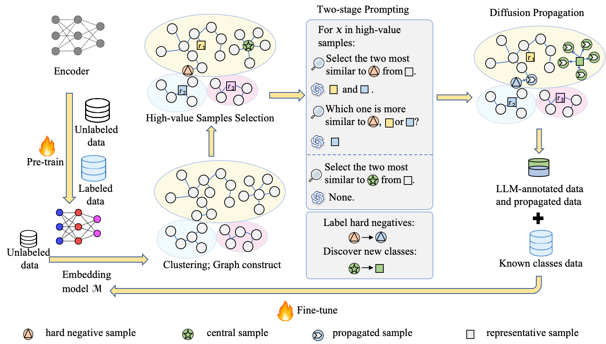

# LDAA
Boosting Generalized Category Discovery with LLM-based Dual Adversarial-Augmented Graph Propagation(LDAA). The overall process is as follows.  



## Requirements
- python==3.10
- pytorch==2.0.1
- transformers==4.29.2
- numpy==1.25.2
- faiss==1.7.2

## Pretrain Model Preparation

Get the pre-trained BERT model by running:
```bash
git clone https://huggingface.co/bert-base-uncased ./pretrained_models/bert
```

## Running

**1. Pretraining**
```bash
sh scripts/lrap/run_pretrain_$dataset$.sh
```

**2. LDAA Turning**
```bash
sh scripts/lrap/run_lrap_$dataset$.sh 
```

## Note

We include the LLM-generated outputs in the repository, which can be found in the folder '[./outs/lrap](./outs/lrap)'.

## Thanks

Some code and instructions reference the following repositories:
- [ALUP](https://github.com/liangjinggui/ALUP)
- [DeepAligned-Clustering](https://github.com/thuiar/DeepAligned-Clustering)


